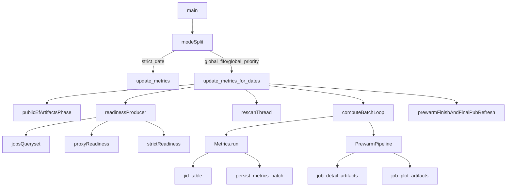

# Exhaustive `update_metrics` Stall Audit

This audit is grounded in the current code under `hpcperfstats/analysis/metrics/update_metrics.py` and every directly reached candidate, readiness, compute, `jid_table`, and artifact/prewarm path. It is also grounded in the supplied production log pattern where one batch of 16 jobs completed, the next batch started, and progress then flatlined for days.

## Executive conclusions

The current scheduler has enough raw throughput to exceed the target of 500 metrics/day when a batch is healthy. The first completed batch in the supplied log processed 16 jobs in about 99 seconds, which is already comfortably above that threshold if sustained. The reason the observed run collapsed to 16 jobs over multiple days is therefore not a steady-state “too small batch size” problem by itself. It requires one or more hard wedge, endless retry/reselection, or silent-failure branches.

The highest-risk branches are:

1. Parent-side metrics persistence can block indefinitely after a worker result arrives, and that block is outside the worker-stall watchdog.
2. Batch completion accounting is batch-granular, so a single wedged jid can make a whole batch look dead while counters stay flat.
3. Worker-side DB failures can be converted into `None` payloads, which are then treated as batch progress without a per-jid failure outcome.
4. Artifact freshness is part of candidate selection, but artifact failure/unavailable paths can leave jobs perpetually re-eligible while still rerunning full metrics compute.
5. The `/pub` EF phase is a hard front-door gate before any job compute starts and has no equivalent of the `Metrics.run` stall watchdog.
6. Large-job `jid_table` setup and eager pandas materialization remain expensive enough that a small set of pathological jobs can wedge the active worker set for an entire batch.

## Scheduler flow map

## Branch inventory

### 1. Scheduler control path

The active scheduler branches live in `hpcperfstats/analysis/metrics/update_metrics.py`.

- `main()` sends `strict_date` through per-day `update_metrics(date)` calls.
- `main()` sends every non-`strict_date` mode through one `update_metrics_for_dates(dates)` pass.
- `update_metrics_for_dates()`:
  - creates the shared metrics pool,
  - runs the `/pub` EF artifact phase first,
  - resets the pool,
  - starts the readiness producer and rescan thread,
  - dequeues up to `effective_batch_cap` jobs at a time,
  - runs `_compute_jid_outcomes_batch()`,
  - then finishes pending prewarm and reruns a final sequential `/pub` refresh in `finally`.

Important control facts:

- `global_priority` does not currently have a distinct scheduling branch in `_fill_ready_queue()`. Only `strict_date` gets unique behavior; the other modes share the same round-robin path.
- The scheduler sets `prefetch_ready_cap` from `metrics_scheduler_ready_queue_target` and `metrics_scheduler_prefetch_chunks`, while compute dispatch uses `effective_batch_cap = min(batch_cap, worker_count * 2, 64)` with a floor of `16`.
- The producer exits after `STALL_EXIT_AFTER_SECONDS` only when it sees no ready progress. That is a producer starvation guard, not a compute wedged-batch guard.

### 2. Candidate and readiness path

Candidate discovery is far more than “give me incomplete jobs.”

- `_jobs_queryset()` filters one day of `job_data` by `end_time__date` and `runtime >= 300`.
- For non-`rerun` passes it annotates:
  - total metrics rows,
  - stale/null metrics rows,
  - PostgreSQL live distinct sample counts,
  - expected plot fingerprint,
  - expected detail fingerprint,
  - matching plot rows,
  - matching detail rows,
  - schema key count,
  - fresh `type_detail` row count.
- Jobs are selected if they need metrics, plots, or detail artifacts.

Readiness then splits into two tiers:

- `_proxy_reject_not_ready_jids()` uses jid-scoped `host_data` to cheaply reject obviously not-ready jobs.
- `_filter_jids_with_samples_after_end()` performs host-list strict readiness by probing latest sample time per host.
- On strict readiness errors/timeouts, `_fill_ready_queue()` falls back to `_strict_ready_fallback_one(jid)` and can end up probing jobs one by one.

### 3. Worker / metrics compute path

The compute path is:

- `_compute_jid_outcomes_batch()`
- `metrics_manager.run(job_refs, pool=shared_pool)`
- `Metrics.run()`
- `_drain_metrics_imap()`
- `_unwrap()`
- `compute_metrics(job)`
- `jid_table.jid_table(job.jid)`
- `_JobForMetrics(jt)` plus simple/complex metric helpers
- parent-side `_persist_metrics_batch()`

Important compute semantics:

- `_drain_metrics_imap()` always submits with `chunksize=1`, regardless of the nominal `pool_chunksize`.
- The worker-stall watchdog only covers “time spent waiting for the next worker payload.”
- Once a payload is received, parent-side persistence is not watchdog-protected.
- Outer scheduler `processed_total` does not move until the entire batch returns from `_compute_jid_outcomes_batch()`.

### 4. `jid_table` path

`jid_table` is a shared cost center for compute and artifacts.

- It counts exact `host_data` rows for the job window.
- If the row count exceeds the large-job threshold, it samples times.
- But sampled mode still builds the sampled time set by materializing all distinct times first.
- It then performs repeated chunked `host__in` scans for host/time data and aggregate dataframes.

This means “sampled large-job mode” is not a cheap early exit; it is still a potentially expensive full-window preparatory path.

### 5. Artifact / prewarm path

After metrics succeed, `_compute_jid_outcomes_batch()` submits prewarm tasks unless prewarm is explicitly skipped.

- `persist_job_detail_artifacts_for_jid()`
- `persist_job_plot_artifacts_for_jid()`
- `refresh_public_expansion_factor_artifacts_parallel()`

Important artifact semantics:

- The `/pub` phase is blocking and runs before any job compute.
- `job_detail_artifacts` logs and swallows per-type `type_detail` failures.
- `job_plot_artifacts` silently skips `plot_item is None`, which means some “legitimately unavailable” plots leave no persistent artifact row.
- `_PrewarmPipeline` only bounds how long the scheduler waits; it does not bound the number of running or queued futures.

## Exhaustive issue list

The issues below are grouped by how directly they can explain “16 jobs processed, then flat for days.”

### Critical

1. **Parent-side `_persist_metrics_batch()` can hang indefinitely.**
   - Files: `hpcperfstats/analysis/metrics/lib/metrics.py`, `hpcperfstats/analysis/metrics/update_metrics.py`
   - Why it matters: `_drain_metrics_imap()` records progress before persisting rows, but the 600s worker-stall watchdog does not wrap persistence at all.
   - Why it matches the log: the second batch can appear to stop after one or more worker results if the parent blocks in `bulk_create`, `bulk_update`, or surrounding transaction work.

2. **The scheduler only reports batch completion, not per-jid completion.**
   - Files: `hpcperfstats/analysis/metrics/update_metrics.py`
   - Why it matters: one wedged jid can keep `processed_total` flat for the whole batch even if some inner worker progress already happened.
   - Why it matches the log: repeated identical progress lines with `inflight_jids=16` are fully consistent with a blocked current batch.

3. **Worker DB failures can be converted into `None` payloads and look like success.**
   - File: `hpcperfstats/analysis/metrics/lib/metrics.py`
   - Branch: `_unwrap()` catches repeated `OperationalError`/`DatabaseError`, logs, and returns `None`.
   - Result: `_drain_metrics_imap()` increments `done`, but no per-jid failure is surfaced to the scheduler.

4. **Artifact-only candidates still rerun full metrics compute.**
   - File: `hpcperfstats/analysis/metrics/update_metrics.py`
   - Branch: `_jobs_queryset()` selects jobs for missing/stale artifacts, but `_compute_jid_outcomes_batch()` always begins with `Metrics.run(...)`.
   - Result: jobs whose metrics are already complete still pay full metrics cost if details or plots are stale.

5. **Artifact failure/unavailable paths can permanently reselect jobs.**
   - Files: `hpcperfstats/site/lib/machine/job_plot_artifacts.py`, `hpcperfstats/site/lib/machine/job_detail_artifacts.py`, `hpcperfstats/analysis/metrics/update_metrics.py`
   - Why it matters:
     - `job_plot_artifacts` skips persistence when `plot_item is None`.
     - `job_detail_artifacts` swallows per-type failures.
     - `_jobs_queryset()` reselects jobs whose plot/detail rows remain missing or stale.
   - Result: endless recompute/prewarm churn.

6. **`type_detail` failures are swallowed, and the current code contains a direct failure branch.**
   - File: `hpcperfstats/site/lib/machine/job_detail_artifacts.py`
   - Branch: per-type `TypeDetailDataProvider(...)` and `plots.DevPlot(...)` inside a broad `except Exception`.
   - Result: the jid can look broadly successful while `type_detail` artifacts remain missing forever.

7. **The `/pub` phase is a hard gate with no watchdog equivalent to `Metrics.run`.**
   - Files: `hpcperfstats/analysis/metrics/update_metrics.py`, `hpcperfstats/site/lib/machine/public_metrics_artifacts.py`
   - Why it matters: `refresh_public_expansion_factor_artifacts_parallel()` uses `pool.imap_unordered(...)` directly with no timeout/poll loop.
   - Result: a stuck `/pub` worker blocks all job compute before it starts.

### High

8. **Candidate SQL runs with statement timeouts effectively disabled.**
   - File: `hpcperfstats/analysis/metrics/update_metrics.py`
   - Branch: `update_metrics_for_dates()` wraps the scheduler body in `_pg_session_statement_timeout_for_metrics_batch()`.
   - Result: heavy candidate/rescan queries can block for arbitrarily long time.

9. **`_jobs_queryset()` duplicates expensive live-distinct work.**
   - Files: `hpcperfstats/analysis/metrics/update_metrics.py`, `hpcperfstats/site/lib/machine/artifact_readiness_expressions.py`, `hpcperfstats/analysis/metrics/lib/live_host_sample_count.py`
   - Why it matters: live distinct time count is annotated directly and also embedded into `PlotArtifactInputFingerprintHex`.
   - Result: extra correlated work per candidate row.

10. **`end_time__date` plus `order_by(-end_time, -jid)` is index-sensitive.**
    - Files: `hpcperfstats/analysis/metrics/update_metrics.py`, `hpcperfstats/site/lib/machine/models.py`
    - Why it matters: day filtering by date-cast is usually less index-friendly than a range predicate, and the keyset order wants a composite order-friendly index.

11. **The rescan thread silently swallows exceptions.**
    - File: `hpcperfstats/analysis/metrics/update_metrics.py`
    - Branch: `_start_candidate_rescan_thread()`
    - Result: candidate rediscovery can fail without any scheduler-visible reason.

12. **The rescan thread repeatedly reissues the same expensive head-of-queue query every 5 seconds.**
    - File: `hpcperfstats/analysis/metrics/update_metrics.py`
    - Why it matters: it replays `_jobs_queryset()` and takes the first `500` jids for every date, even while the producer is already paging that same backlog.

13. **The queue-vs-compute shape is intentionally imbalanced.**
    - Files: `hpcperfstats/analysis/metrics/update_metrics.py`, `hpcperfstats/dbload/lib/dbload/lib/conf_parser.py`
    - Why it matters: `ready_queue_target` defaults high while compute batch cap bottoms out at `16`.
    - Result: thousands of “ready” jobs can accumulate while only one small batch is inflight.

14. **`metrics_scheduler_compute_threads` is parsed but does not control current compute dequeue concurrency.**
    - Files: `hpcperfstats/dbload/lib/dbload/lib/conf_parser.py`, `README.md`
    - Why it matters: operators can tune a knob that does not affect the actual scheduler bottleneck.

15. **Strict readiness can devolve into expensive per-jid probes after timeout/error.**
    - File: `hpcperfstats/analysis/metrics/update_metrics.py`
    - Branch: `_fill_ready_queue()` -> `_strict_ready_fallback_one()`
    - Result: one bad strict batch can explode into many single-jid host probes.

16. **Proxy readiness can fail open into strict readiness for almost every job.**
    - File: `hpcperfstats/analysis/metrics/update_metrics.py`
    - Why it matters: if `host_data.jid` is sparse or unreliable, the cheap jid-scoped proxy rejects little and the expensive strict path carries almost all traffic.

17. **Large-job `jid_table` sampling still materializes full distinct-time sets.**
    - File: `hpcperfstats/analysis/metrics/lib/gen/jid_table.py`
    - Branches: `_count_host_data_rows_for_window_cached()`, `_distinct_times_in_window_batched()`, `_strided_distinct_times_for_large_job()`, `_apply_large_job_time_sampling_if_needed()`
    - Result: the “sampled” path still pays large preparatory costs.

18. **`_JobForMetrics` eagerly materializes full host/time/type/event/value dataframes.**
    - File: `hpcperfstats/analysis/metrics/lib/metrics.py`
    - Why it matters: full host-data dataframe load, grouping, pivoting, and NumPy copies can make a handful of jobs monopolize all active workers.

19. **`time_imbalance` is quadratic in time slices.**
    - File: `hpcperfstats/analysis/metrics/lib/metrics.py`
    - Result: jobs with many sampled timestamps can become severe CPU hotspots.

20. **Workers still write `job.host_data_schema_json` directly.**
    - File: `hpcperfstats/analysis/metrics/lib/metrics.py`
    - Result: worker-side DB write latency or locks can stall a worker in a place not described by the “writes happen in main process only” expectation.

21. **`_PrewarmPipeline` backlog is unbounded.**
    - File: `hpcperfstats/analysis/metrics/update_metrics.py`
    - Result: detail/plot prewarm can keep adding work faster than it is drained, increasing DB/cache pressure and making `finish()` expensive.

22. **`_PrewarmPipeline.finish()` can exceed its nominal wall budget by `pending_futures * timeout`.**
    - File: `hpcperfstats/analysis/metrics/update_metrics.py`
    - Why it matters: `drain_some(force=True)` calls `fut.result(timeout=60)` serially across all pending futures.

23. **Plot prewarm constructs `jid_table` and aggregate bundles before checking freshness.**
    - File: `hpcperfstats/site/lib/machine/job_plot_artifacts.py`
    - Result: plot prewarm pays heavy setup cost even when all plot rows are already fresh or when the jid was selected for detail reasons only.

24. **Public EF worker failures are converted into counters rather than a scheduler-visible hard failure.**
    - File: `hpcperfstats/site/lib/machine/public_metrics_artifacts.py`
    - Result: `/pub` can “finish” in a degraded state and the scheduler moves on.

### Medium

25. **Reporter cadence is too coarse for 10-minute stalls.**
    - File: `hpcperfstats/analysis/metrics/update_metrics.py`
    - Result: the default 1-hour completion reporter is too slow for diagnosing 600s wedges.

26. **`strict_ready_jids` can momentarily outrun `ready_enqueued_total` due to sampling race.**
    - File: `hpcperfstats/analysis/metrics/update_metrics.py`
    - Why it matters: producer updates `strict_ready_jids` while filling `local_ready`, then later extends `ready_queue` and increments `ready_enqueued_total`.
    - Result: some snapshots can look internally inconsistent even when no job has been lost.

27. **`pool_reset_confirmed` is optimistic in shared-pool stall recovery.**
    - File: `hpcperfstats/analysis/metrics/lib/metrics.py`
    - Result: logs can claim the pool was reset even when worker termination was not actually verified.

28. **Cache-backed helpers can degrade silently into repeated DB work or block on cache I/O.**
    - Files: `hpcperfstats/site/lib/machine/cache_utils.py`, `hpcperfstats/analysis/metrics/lib/gen/jid_table.py`, GPU/FSIO helpers
    - Result: Redis/cache instability can inflate worker latency without a crisp per-jid failure signal.

29. **Some GPU/FSIO helper failures are treated as no-data rather than explicit failure.**
    - Files: `hpcperfstats/analysis/metrics/lib/gpu_job_detail_summary.py`, `hpcperfstats/analysis/metrics/lib/job_detail_fsio.py`
    - Result: silent degradation hides the true failure class and can contribute to artifact churn.

## Mapping the supplied log to likely branches

The supplied log most strongly points to a compute-side wedge, not a pure readiness starvation.

What the log already tells us:

- `/pub` EF artifacts completed and the pool was recycled.
- Candidate scanning discovered many jobs.
- First batch of 16 completed in about 99 seconds.
- Second batch of 16 started.
- Progress then flatlined while `inflight_jids=16`.
- Repeated hourly lines showed no further completions.

What that most likely means:

1. The producer was not the primary bottleneck once the second batch started.
2. The second batch wedged in one of these places:
   - worker-side `jid_table` setup or eager host-data materialization,
   - worker-side metric helper hot path,
   - parent-side `_persist_metrics_batch()`,
   - or a batch-level artifact/prewarm branch if prewarm was inline.
3. The earlier `plot artifact prewarm failed: name 'jid_table' is not defined` and `prewarm drain budget hit` lines show that artifacts were already broken enough to create repeat-work pressure, even before the later compute wedge.

The log also implies an instrumentation caveat:

- `strict_ready_jids` becoming large while `attempted_total` stays small is expected under the current queue shape.
- `strict_ready_jids` rising while `ready_enqueued_total` appears flat can happen transiently mid-producer iteration, so that specific mismatch is not by itself proof that the queue lost jobs.

## Throughput model

The key throughput fact is that the healthy first batch was already good enough.

- First batch: `16` jobs in `99.38s`
- That is about `0.161` jobs/s
- That is about `581` jobs/hour
- That is about `13,900` jobs/day if sustained

So the system does not need a 28x optimization to reach 500/day. It needs the hard-wedge and endless-reselection branches removed so the observed healthy-path throughput can continue.

What the current defaults mean operationally:

- High `ready_queue_target` means the producer can get far ahead of compute.
- `effective_batch_cap` flooring at `16` means only a small batch is ever exposed to the main loop at once.
- If the first active worker set in that batch contains pathological jobs, the entire visible batch can stall.

The true throughput killers are therefore:

- hard compute wedges,
- parent-side persistence hangs,
- large-job fanout hot spots,
- artifact churn that requeues already-computed jobs,
- and blocking `/pub` or prewarm phases that consume wall time without producing retired jobs.

## Prioritized remediation sequence

### Immediate blockers

1. Add bounded timeout/diagnostics around parent-side `_persist_metrics_batch()`.
2. Stop treating worker `None` payloads as implicit success; surface them as explicit failed jids.
3. Add per-jid phase timing inside compute so a blocked batch can be localized to:
   - `jid_table_init`
   - `full_host_data_df`
   - `simple_metric_queries`
   - `complex_metrics`
   - `persist_metrics_batch`
4. Fix the current `type_detail` failure branch and stop swallowing artifact incompleteness as broad success.
5. Add a watchdog or bounded fallback for the `/pub` EF parallel phase.

### High-probability throughput killers

6. Split metrics candidates from artifact-only candidates, or add an artifact-only fast path that skips `Metrics.run` when metrics are already complete.
7. Remove duplicated live-distinct work from `_jobs_queryset()` / artifact fingerprint expressions.
8. Replace `end_time__date` with a range predicate and verify ordering/index support for the keyset scan.
9. Make `global_priority` either real or rename it so logs do not imply nonexistent behavior.
10. Make prewarm freshness checks happen before expensive `jid_table` / aggregate setup wherever possible.
11. Put a hard backlog cap on `_PrewarmPipeline` or apply backpressure from compute.
12. Rework large-job `jid_table` sampling so it does not first materialize the entire distinct-time set.

### Secondary amplifiers

13. Revisit `time_imbalance` complexity and consider a cheaper approximation or guard for large sampled jobs.
14. Move worker-side schema writes out of the worker path or at least log/time them explicitly.
15. Tighten rescan diagnostics and avoid replaying the same expensive head query every 5 seconds when the queue is already saturated.
16. Shorten heartbeat cadence during backfills or add a separate short-interval stall reporter.

## Validation gates

Every remediation should be validated against both correctness and sustained throughput.

### Healthy-run counter expectations

- `ready_enqueued_total` should continue rising while there is backlog.
- `ready_dequeued_total` should grow steadily and track batch dispatch.
- `inflight_jids` should rise at batch start and return to `0` between healthy batches.
- `attempted_total` should grow continuously.
- `processed` should grow at a steady cadence rather than only after long flat periods.
- `batch_compute_exceptions_total` and `per_jid_fallback_failures_total` should stay near zero in a healthy backlog run.

### Log signatures that should become diagnosable

- Parent persistence blocked
- Worker waiting in `jid_table`
- Worker hot metric helper
- Artifact-only reselection loop
- `/pub` phase stuck
- prewarm backlog saturation
- silent worker DB skip

### Required regression coverage

Add or extend tests for:

- parent-side persist hang detection,
- worker `None` payloads becoming explicit failures,
- batch-granular accounting blind spots,
- shared-pool reset truthfulness,
- large-job `jid_table` sampled-mode behavior,
- artifact-only candidate handling,
- partial artifact failure classification,
- `/pub` stall and failure reporting,
- `_PrewarmPipeline.finish()` respecting a real bounded wall budget.

### Throughput success criterion

Run a benchmark or compose-backed diagnosis scenario large enough to exercise:

- candidate SQL,
- readiness,
- compute,
- large-job `jid_table`,
- and artifact prewarm.

The pass condition is not merely “no traceback.” It is:

- sustained retirement of at least `500` jobs/day equivalent under the chosen benchmark cohort,
- no flatline where `inflight_jids > 0` and `processed_total` remains constant for long windows,
- and no repeated reselection of already-computed jobs due solely to artifact failure/unavailable semantics.

## Bottom line

The current code already contains enough evidence to explain the observed behavior without inventing exotic root causes. The system can process jobs quickly on healthy batches, but it still contains multiple hard-stop and silent-retry branches that can turn one pathological batch into days of apparent deadlock. The remediation order should therefore focus first on blocked-batch visibility and termination, then on artifact reselection loops, and only after that on deeper throughput tuning.
