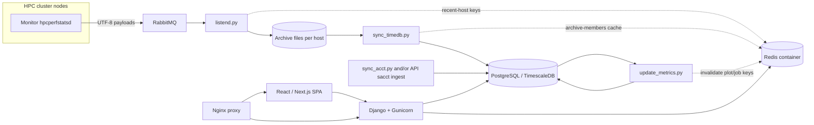
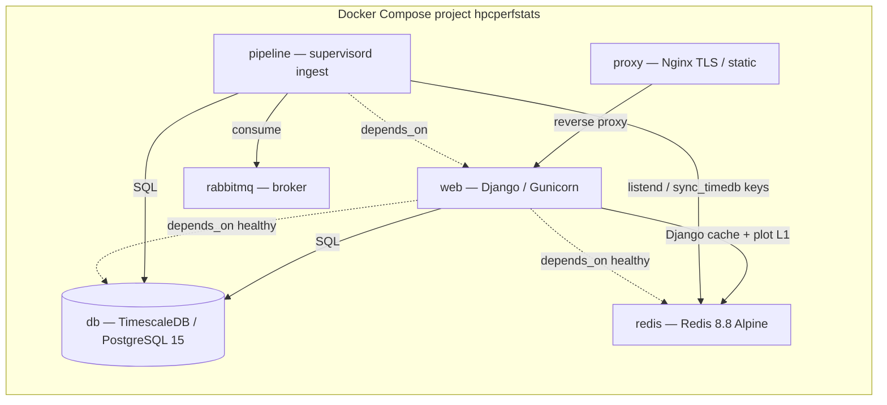

# HPCPerfStats — System Design Document

| Field | Value |
|--------|--------|
| **Status** | As-built reference (describes the current repository layout and contracts) |
| **Last updated** | 2026-07-24 |
| **Scope** | Monitor daemon (C), Python ingest/analysis/site stack, Docker Compose deployment |

This document follows a structure common to technical design docs (problem/context → goals → architecture → data → contracts → operations → risks/alternatives → open questions), aligned with practices described in industry write-ups on design documentation (for example [Google-style design doc flow](https://www.lodely.com/blog/design-docs-at-google) and similar architecture templates).

---

## 1. Context and problem statement

HPC centers need **multi-resolution visibility** into how jobs use nodes: CPU, memory, accelerators, network, and power, correlated with **scheduler accounting** (job IDs, time ranges, nodelist). Raw telemetry alone is not enough; operators and researchers need **job-indexed** views and derived metrics.

**HPCPerfStats** (formerly known as TACC Stats) addresses this by combining:

1. A **lightweight node daemon** that samples hardware and ships UTF-8 text payloads to a message broker.
2. An **off-cluster** Python stack that archives raw messages, loads structured rows into **PostgreSQL/TimescaleDB**, computes **aggregates and plots**, and serves a **Django + React (Next.js)** web application.

---

## 2. Goals and success criteria

### 2.1 Goals

- **Collect** representative node-level performance samples on cluster nodes with bounded overhead (see `HPCPerfStats/README.md` and `docs/measurements/monitor_overhead_stampede3_spr_2026-08-14.md` for a recorded Stampede3 SPR `pidstat` capture).
- **Reliably transport** samples from nodes to a central service via **RabbitMQ**.
- **Persist** raw archives and normalized time-series/job records for audit and reprocessing.
- **Join** node telemetry with **Slurm accounting**–backed job metadata to support per-job analysis.
- **Expose** curated metrics, tables, and Bokeh-backed plots through the web UI and APIs.

### 2.2 Non-goals

- Replacing the site batch scheduler or owning cluster provisioning.
- Modifying application source code on user jobs (optional **XALT**-related documentation and checks are governed by workspace rules; XALT itself is upstream).
- Guaranteeing sub-second real-time dashboards for every metric (the pipeline is **near-line**; latencies depend on ingest intervals and worker scheduling).

### 2.3 How we measure “healthy” operation

Operational signals used in this repo (not a complete SLO spec):

- Compose **healthchecks** for `db`, `redis`, `rabbitmq`, and `proxy` (`docker-compose.yaml`).
- Automated tests for **listend** message handling, **sync_timedb** archive edge cases, metrics updates, and web/API behavior (`HPCPerfStats/docs/TESTING.md`).
- **Idempotent** metrics recomputation expectations where documented under ingestion/metrics rules.

---

## 3. High-level architecture

### 3.1 Data flow

### 3.2 Compose containers (central stack)

All central services run on the Compose network **`hpcperfstats_net`**. Service definitions live in **`docker-compose.yaml`**, which `include`s site-local **`docker-compose.settings.yaml`** (bind volumes and optional knobs; bootstrap from **`.example`**).

**Deployment split:**

- **On nodes:** C monitor (`HPCPerfStats/monitor/`), typically via RPM/systemd (`hpcperfstats` service).
- **Central stack:** Docker Compose (`docker-compose.yaml` includes `docker-compose.settings.yaml`): **`web`**, **`pipeline`**, **`db`**, **`redis`**, **`rabbitmq`**, **`proxy`**.

---

## 4. Stakeholders and consumers

| Role | Need |
|------|------|
| **HPC operators** | Operate compose services, storage paths, credentials, broker capacity, and ingest schedules. |
| **Researchers / users** | Inspect job performance, compare runs, interpret plots and summaries. |
| **Developers** | Preserve **monitor↔consumer** and **`host_data.type`↔analysis** contracts when extending metrics or UI. |

Primary maintainer contact appears in `pyproject.toml` authors (Texas Advanced Computing Center).

---

## 5. Component inventory

### 5.1 Monitor (C daemon)

- **Purpose:** Collect node-level statistics from MSRs, `/proc`, `/sys`, accelerators (e.g. DCGM), network counters, etc., and publish **one message per sample** to RabbitMQ (or append in file mode).
- **Build:** Autotools; production packaging via static-bundle + RPM spec under `HPCPerfStats/monitor/` (see `README.md`).
- **Workspace rule split:** Application Python code treats `monitor/` as **read-only** unless the user explicitly approves edits; monitor-only work follows `HPCPerfStats/monitor/cursor-rules/` (which explicitly **ignores** `HPCPerfStats/hpcperfstats/cursor-rules/` for monitor changes).

### 5.2 Docker Compose services

| Service | Role |
|---------|------|
| **web** | Builds from repo `Dockerfile` (`hpcperfstats-full`); runs Django via `services-conf/django_startup.sh`; exposes app port (default host `8000` via `HPCPERFSTATS_WEB_PORT`). **Depends on healthy `db` and healthy `redis`.** |
| **pipeline** | Same image as `web`; runs `supervisor_startup.sh` to supervise long-running ingest/processing programs (see §6). Uses the **`hpcperfstatsdata`** bind for archive, accounting, daily archive, and **cluster syslog** under **`/hpcperfstats/logs/`** (bind `device:` in **`docker-compose.settings.yaml`**). Reaches **`db`**, **`redis`**, and **`rabbitmq`** on `hpcperfstats_net`. |
| **db** | TimescaleDB on PostgreSQL 15 (`timescale/timescaledb:2.28.3-pg15`); primary system of record. Compose sets large **`shm_size`** and Postgres tuning (`shared_buffers`, timeouts, WAL) for concurrent Django + pipeline load. |
| **redis** | **Dedicated Compose container** (`redis:8.10.0-alpine3.23` in `docker-compose.yaml`). Network alias **`redis`**. Shared instance: Django cache (TTL keys) plus pipeline **`job:v1`** queues (TTL-free). **`maxmemory` 16gb** with **`volatile-lru`** (not **`allkeys-*`**, which would evict durable queue members). `appendonly no`; multi **`io-threads`**. Healthcheck: `redis-cli ping`. Cache pages/plots remain ephemeral; `job:v1` keys are the in-flight work record while the orchestrator is running. |
| **rabbitmq** | Broker for monitor→site message delivery (`rabbitmq:4.3.4-management-alpine`, AMQP **5672** published; management HTTP **15672** compose-internal only). Admin Monitor queue/node stats use the management API from `web`, not AMQP. Memory cap: Compose **`mem_limit` / `memswap_limit` 96g** plus **`vm_memory_high_watermark.absolute = 80GiB`** (`services-conf/rabbitmq_vm_memory.conf`) so publishers block ~16 GiB below the cgroup wall instead of growing unbounded or hitting Erlang `binary_alloc`. |
| **proxy** | Nginx TLS/front door; **`docker-compose.yaml`** mounts committed **`services-conf/nginx.conf`** as **`default.conf`** and **`proxy_ssl_source:/mnt/ssl-source:ro`**; image build **`cp`**s **`nginx.conf`**, generates **`hps-proxy-allowed-hosts.inc`** from INI; **`proxy_entrypoint.sh`** materializes TLS PEMs from the settings mount into fixed paths under **`/etc/ssl/hpcperfstats`**. Serves staticfiles/media and proxies API/HTML to **`web`**. |

### 5.3 Python package layout (concise)

- **`hpcperfstats/listend.py`** — RabbitMQ consumer; archive writer (§7.2); optional Redis recent-host tracking.
- **`hpcperfstats/dbload/`** — Time-series and accounting loaders (`sync_timedb.py`, `sync_acct.py`, helpers); archive-members Redis coordination under `dbload/lib/`.
- **`hpcperfstats/analysis/`** — Metrics computation, plotting, roofline and vendor-specific logic; **`update_metrics.py`** persists plot/detail artifacts after recompute.
- **`hpcperfstats/site/`** — Django project, DRF APIs, OpenAPI schema, React/Next frontend under `site/frontend/`.

### 5.4 External API client

- **`hpcperfstats-tools`** (in-tree monorepo directory under this checkout; separate Python distribution / import `hpcperfstats_tools`) is the **canonical CLI/client** for the Django API (endpoints, auth headers, schemas). Server-side business rules stay in Django; the client validates responses (workspace guardrails).

---

## 6. Runtime processes (pipeline)

The tracked supervisor configuration (`services-conf/supervisord.conf`) defines long-running programs including:

- **`listend.py`** — RabbitMQ listener (archive append/rotation).
- **`sync_timedb.py backlog`** — Imports node-level data from the archive into the database; runs until stopped, rescans for new files after each wave, and sleeps when the queue is empty. Startup still runs the archive snapshot + boot handoff for ingest catch-up. Under dual-mode with ``current``, CLI **`all` is ingest-only for day-close** (no day-close discover / seal / delete). Date-window runs and CLI ``current`` own day-close. When enabled, **archive-members Redis** prewarm/coordination reduces repeated tar member scans (see `sync_timedb_archive_members_redis`).
- **`update_metrics.py`** — Builds/updates job-indexed and secondary metrics from DB state; persists **`job_plot_artifact`** / **`job_detail_artifact`** and invalidates related Redis keys.

It also includes **`rsync_data`** (via **`rsync_data_wrapper.sh`**, preferring guarded **`rsync_data.sh`** then **`rsync_data.sh.example`**), **syslog-ng** (with **`render_syslog_ng_generated`** from **`[SYSLOG]`** in `hpcperfstats.ini`), **`seal_syslog_daily`** to pack prior-day per-host logs into **`logs/log_archive/YYYY-MM-DD-syslog.tar.gz`**, and related operational logging.

**Accounting (job-level) ingest** is **not** a separate supervisord program: operators either:

- Run **`sync_acct.py`** on a schedule against pipe-delimited files under the configured accounting directory (date-prefixed filenames), and/or  
- Use **`hpcperfstats-sacct-gen`** from **hpcperfstats-tools** to run `sacct` and **POST** results to the API ingest path (`README.md`).

---

## 7. Data design

### 7.1 Glossary

| Term | Meaning |
|------|--------|
| **Node-level data** | Raw performance samples from a host; **not** inherently tied to a job ID in the payload. |
| **Job-level data** | Scheduler accounting fields (job ID, user, start/end, nodelist, partition, etc.). |
| **Job-indexed data** | Derived association of node samples with jobs using time overlap and nodelist, plus downstream aggregates. |

### 7.2 Archive layout (listend)

`listend.py` appends monitor payloads under the configured **archive directory**, per host, using a **`current`** file and **`$`-prefixed rotation** semantics. Epoch-named files and hardlink relationships are coordinated so **`sync_timedb`** can avoid racing active writes (see `hpcperfstats/dbload/lib/sync_timedb_archive_helpers.py` and listend tests). This is the **transport/archive contract** documented in `HPCPerfStats/monitor/cursor-rules/monitor-workspace-contract.mdc`.

**Cluster syslog (pipeline):** under the same **`data_dir`** bind mount, **`logs/current/`** holds live per-host syslog files (date in the filename), and **`logs/log_archive/`** holds sealed **daily** **`*.tar.gz`** bundles—analogous in operator terms to **`archive_dir`’s `current`** workflow and **`daily_archive`** cold storage, though the on-disk mechanics differ.

**Canonical consumer/parser contract** for monitor output: treat **`hpcperfstats/listend.py`** as source of truth for:

- UTF-8 text payloads.
- **Schema/rotation** lines starting with `$` (host identification on the consumer side uses the prescribed token positions).
- **Stats** lines: whitespace-separated fields with **host as the third token** (`<timestamp> <jobid> <host> ...`).

### 7.3 Database and metrics

- Time-series and job tables are read by **`update_metrics.py`** to populate derived metrics used by the site and plots.
- **Deterministic, DB-backed aggregation** is preferred over ad-hoc recompute (runtime/metrics safety rule).
- Durable plot/detail embeds live in PostgreSQL as **`job_plot_artifact`** and **`job_detail_artifact`** (gzip JSON); Redis holds only short-TTL / L1 copies where configured.

### 7.4 Monitor ↔ analysis contract (`host_data.type`)

The monitor publishes **`host_data.type`** strings (from C `stats_type.st_name` / schema). **Analysis code must treat those names as the contract**: Intel IMC ordering, PMC priority, AMD (`amd64_pmc` / `amd64_df`), ARM/Grace paths, and **roofline nominal peaks** must stay aligned with what the monitor can emit.

Canonical Python references (see `HPCPerfStats/hpcperfstats/cursor-rules/monitor-analysis-architecture-sync.mdc` and `hpcperfstats/analysis/README_ARCH_AGNOSTIC.md`):

- `hpcperfstats/dbload/lib/monitor_naming/canonical.py` — `INTEL_IMC_STATS_TYPES` and related type name sets (legacy aliases in `monitor_naming/legacy.py`).
- `hpcperfstats/analysis/metrics/lib/plot/roofline_peaks.py` — peak tables and inference.
- `hpcperfstats/analysis/metrics/lib/plot/roofline.py` — merge logic.

### 7.5 Redis roles (same container, multiple key namespaces)

The **`redis` Compose service** is the single shared Redis instance. Django configures it via `cfg.get_redis_location()` (`django.core.cache.backends.redis.RedisCache`, key prefix `hpcperfstats`). Host pytest normally uses LocMem unless `HPCPERFSTATS_PYTEST_LIVE_REDIS=1` (compose Redis workflows).

| Role | Typical consumers | Notes |
|------|-------------------|--------|
| **Django / ORM view cache** | `web` (`cache_utils.py`) | Versioned keys such as **`KEY_JOB`** (pickled `job_data`), site filter facets, GPU/XALT/proc helpers. Stale pickled prefetch must be refreshed on read when metrics rows change. |
| **Job plot L1** | `web` (`job_plots` / `job_plot_artifacts`) | Short-lived Bokeh `json_item` embeds; oversized payloads may skip Redis. L2 durable store is **`job_plot_artifact`** in Postgres. |
| **Invalidation** | `update_metrics`, ingest/sync paths | Deletes plot keysets and related job keys so recomputes are visible after refresh. |
| **Archive-members coordination** | `pipeline` / `sync_timedb` | Optional Redis-backed member lists for sealed archive tars (`sync_timedb_archive_members_redis`). |
| **listend auxiliaries** | `pipeline` / `listend.py` | Recent-host tracking and similar operational keys—not a substitute for the on-disk archive. |

Operator tuning for this container (memory cap, LRU, threads) is in **`docker-compose.yaml`** under **`redis:`**; see also `docs/DEPLOY_CONCURRENCY_AND_NUMA.md` when aligning host/VM sizing.

---

## 8. Web application and APIs

- **Django** serves the backend; **DRF** exposes JSON APIs consumed by the React SPA and by **hpcperfstats-tools**.
- **OpenAPI** schema under `site/openapi/` drives **orval**-generated TypeScript clients in the SPA (`frontend-stack-wiring-contract` / `openapi-orval-sync` rules).
- **React / Next.js** SPA routes under **`/machine/`** (static export / Nginx delivery; see web E2E and frontend prod-build rules).
- **Job Detail** surfaces include scheduler fields, Metrics, Summary and TypeDetail Bokeh embeds, Processes, and GPU / Multiprecision panels served from **`job_detail_artifact`** when present (researcher guide: `docs/using-the-website-as-a-researcher.md`).
- **Display policy:** User-visible numbers and plot ticks must **not** use scientific notation (dedicated workspace rule: use shared formatters in Python/Bokeh and `formatDecimalStandard` / standard notation in JS).

---

## 9. Security, configuration, and operations

- **Configuration** is driven by `hpcperfstats.ini` (container path commonly `/home/hpcperfstats/hpcperfstats.ini`) and files under `services-conf/`. `*.example` files document intended shapes; copy/rename per `README.md`. **Immutable-image policy:** bake INI into the image; do not bind-mount a mutable INI over production containers unless an explicit local-dev exception applies.
- **Secrets** (TLS certs, API keys) are environment- and deployment-specific; TLS PEMs are read from the **`proxy_ssl_source`** settings volume at **`proxy`** container start and materialized under **`/etc/ssl/hpcperfstats`**; Django settings and nginx consume fixed paths defined in `services-conf/`.
- **CSP** changes should be minimal and scoped when touching frontend pages (React workspace rule).
- **Redis** holds no durable user data; flushing Redis is safe for correctness after a cold start (expect temporary cache misses and higher DB/plot rebuild cost). Archive files and Postgres remain authoritative.

---

## 10. Testing and documentation expectations

- **Python:** pytest with Django settings (`pyproject.toml`); many tests under `hpcperfstats/tests/` and `hpcperfstats/site/.../tests/`.
- **Web E2E:** `test_web_pages_e2e.py` and Playwright `test_web_pages_browser_e2e.py` must be updated when web routes or SPA behavior changes.
- **Compose workflows:** For DB/Redis-dependent tests, use the Docker Compose network so hostnames like `db` and **`redis`** resolve (see `full-test-with-db-redis` and `local-compose-db-lifecycle-for-web-tests` rules; Redis cache workflow: `tests/run_redis_cache_pytest_workflow.sh`).
- **Testing entrypoints:** `HPCPerfStats/docs/TESTING.md` must stay in sync when test commands or runners change.

---

## 11. Alternatives considered (historical / architectural)

This section records **typical** tradeoffs implicit in the design—not a formal ADR log.

| Alternative | Why not primary here |
|-------------|----------------------|
| Pull-based polling from nodes | Push via RabbitMQ decouples node connectivity from DB availability and buffers bursts. |
| Single monolithic “do everything” container | Split **web** vs **pipeline** isolates request serving from long-running ingest loops. |
| Only API-based accounting | File-based **`sync_acct.py`** remains supported for sites that batch-export `sacct` output to disk. |
| Persist all plot payloads only in Redis | Durable **`job_plot_artifact` / `job_detail_artifact`** in Postgres survive Redis eviction; Redis is L1 / coordination only. |
| Co-locate Redis inside the web image | A **dedicated `redis` Compose service** keeps cache lifecycle, healthchecks, and memory policy independent of Gunicorn restarts. |

---

## 12. Open questions and follow-ups

- **Exact production scheduling** for `sync_acct.py` vs API-only ingest varies by site; document operator runbooks per deployment.
- **Capacity planning** (RabbitMQ queue depth, archive storage growth, DB retention, Redis `maxmemory`) is deployment-specific and not fully specified in-repo.
- **Per-site hostname allowlists and INI paths** (`HPCPERFSTATS_INI`) must match compose mounts—verify on each environment.

---

## 13. References (in-repo)

| Topic | Location |
|-------|-----------|
| Install, monitor RPM, broker config, and **index of all `docs/`** | `HPCPerfStats/README.md` |
| Telemetry / variable definitions (canonical) | `docs/MONITOR_VARIABLES.md` |
| Regenerate / augment `MONITOR_VARIABLES.md` | `docs/regenerate_monitor_variables_catalog.py`, `docs/augment_monitor_variables_diagnostics.py` |
| Researcher-facing web UI guide | `docs/using-the-website-as-a-researcher.md` |
| Architecture-agnostic analysis | `hpcperfstats/analysis/README_ARCH_AGNOSTIC.md` |
| Compose topology (**redis** / db / rabbitmq / proxy / web / pipeline) | `docker-compose.yaml`, `docker-compose.settings.yaml.example` |
| Supervisor programs | `services-conf/supervisord.conf` (rsync via `rsync_data_wrapper.sh`) |
| Job plot / detail caching | `hpcperfstats/cursor-rules/job-plot-artifacts-caching.mdc`, `site/lib/machine/job_plot_artifacts.py` |
| Workspace guardrails (monitor/tools/nginx/redis) | `HPCPerfStats/hpcperfstats/cursor-rules/workspace-guardrails.mdc` |
| Monitor message contract | `HPCPerfStats/monitor/cursor-rules/monitor-workspace-contract.mdc` |
| Monitor ↔ analysis type sync | `HPCPerfStats/hpcperfstats/cursor-rules/monitor-analysis-architecture-sync.mdc` |
| Deploy concurrency / pool sizing | `docs/DEPLOY_CONCURRENCY_AND_NUMA.md` |
