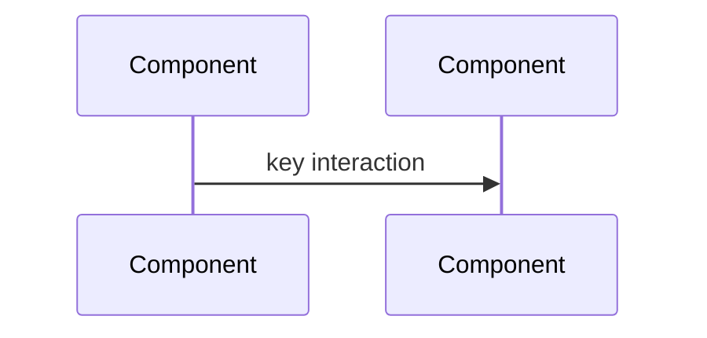

# Plan title (short)

One-line overview of the outcome.

**Governed by:** `plan-creation-contract.mdc`, `plan-completion-gate.mdc`, `implementation-review-workflow.mdc`.

**Applies to:** pre-code chat plans, committed design docs in `docs/plans/`, monitor **Consumer follow-up plan** sections, and Cursor Plan mode output.

**Artifact placement:** this file is a **committed design baseline** (`test-runs-output-directory.mdc`). Ephemeral run logs and pytest captures go under **`test_runs/`**, not `docs/`.

---

## Cursor Plan frontmatter (optional)

Use when authoring in Cursor Plan mode. Do **not** edit committed plan files the user marked read-only.

```yaml
---
name: short-kebab-name
overview: "One sentence outcome"
todos:
  - id: step-one
    content: "First implementation step"
    status: pending
  # … one todo per major step …
  - id: post-implementation-review
    content: "Structured self-review in chat (why it works, edge cases, convention check); fix gaps before close"
    status: pending
isProject: false
---
```

---

## 1. Problem and facts

**Grounding (no guessing)** — per `plan-creation-contract.mdc`:

- Verified current behavior (cite modules, tests, logs, or committed docs read — not assumptions).
- Constraints and **user-confirmed** decisions.
- Affected layers (monitor ingest, dbload, analysis, API, SPA, compose, operator docs).
- Open questions: list any unclear requirement and **ask the user** before implementing.

## 2. Approach

Ordered steps with trade-offs.

**Industry best practices** — name what informs the plan (e.g. test pyramid — unit before compose E2E; fail-closed ingest; WCAG 2.2 AA for web). Prefer project rules (`testing-best-practices.mdc`, layer-specific `*.mdc`) where they already encode local practice.

Optional architecture diagram:



## 3. Testing

Every behavior change needs at least one **regression and/or unit test** at the narrowest layer (`test-first-discipline.mdc`, `every-error-regression-test.mdc` for fixes).

| Test | Module | Contract |
|------|--------|----------|
| `test_…` | `hpcperfstats/tests/…` or colocated `test_*.py` | What it proves |

**Pre-merge verification matrix** (`testing-best-practices.mdc`) — pick the minimum tier:

| Change touches | Minimum run |
|----------------|-------------|
| Pure Python utils / dbload helpers | `python scripts/run_tests.py --no-django` + targeted module |
| Django API / machine models | Host mock tests + `tests/run_db_pytest_workflow.sh` if DB semantics change |
| Ingest / archive / metrics | Compose db pytest + contract tests |
| Web UI / routes | Vitest + `tests/run_web_e2e_workflow.sh` |
| Metrics catalog / monitor types | Unit + pipeline E2E when payloads change |

Runner (copy-paste from git checkout with `pyproject.toml`):

```bash
cd HPCPerfStats && ../.venv/bin/python3 -m pytest -q path/to/tests …
```

**Validation runbook** (`logic-change-checklist.mdc`):

1. Run smallest targeted test modules first.
2. Escalate to compose workflows when DB/Redis/RabbitMQ semantics apply (`compose-required-for-data-services-changes.mdc`, `colima-docker-runtime.mdc`).
3. Append results to **`test_runs/test_run_log_YYYY-MM-DD.md`** (command, exit code, blockers) — not `docs/`.
4. Record residual risks if anything was skipped.

**Bugfix / perf / reliability** — also follow `bugfix-and-perf-change-playbook.mdc` and `exhaustive-error-path-analysis.mdc` when chasing a specific failure signature.

## 4. Implementation

| Concern | Location |
|---------|----------|
| … | `path/to/module.py` |

Omit this section for answer-only or doc-only work with no logic change.

## 5. Cursor rules / docs sync

Per `plan-creation-contract.mdc` step 5:

- **Add or update** a focused `hpcperfstats/cursor-rules/*.mdc` when the plan introduces a **recurring** pattern (layer wiring, config contract, test workflow, safety invariant). Monitor-only patterns → `monitor/cursor-rules/` when not repo-wide.
- **Prefer updating** an existing rule over duplicating; add an **Overlap** section when cross-linking.
- Or state **no rule change needed** + one-sentence rationale.
- **Ask the user** before writing rule text if scope is unclear.

**Docs sync** (when triggered):

| Trigger | Update |
|---------|--------|
| Test workflow / commands | `docs/TESTING.md` (`testing-doc-sync.mdc`) |
| Operator setup / compose | `README.md` (`readme-installation-sync.mdc`) |
| User-visible metrics/search/UI | `docs/using-the-website-as-a-researcher.md`, frontend metadata |
| Deploy / concurrency tuning | `docs/DEPLOY_CONCURRENCY_AND_NUMA.md` |

## 6. Consumer follow-up plan (optional)

**Only when monitor output changes need consumer work** (`monitor/cursor-rules/monitor-consumer-side-plan.mdc`). Do not implement consumer code unless the user authorizes it.

### Consumer follow-up plan

1. **Why** — monitor behavior changed; current consumer cannot handle it.
2. **What** — concrete consumer tasks (files/functions/tests).
3. **Rollout** — deploy order (consumer first vs together vs monitor escape hatch).
4. **Verification** — consumer tests or manual checks after both sides land.
5. **Rename/migration** — YAML map, dashboard/query updates if applicable.

State in the monitor summary: **consumer plan attached** or **no consumer changes required**.

## Invariants / edge cases

| Case | Expected |
|------|----------|
| … | … |

**Runtime logic** — also cover `logic-change-checklist.mdc` when behavior changes:

- Upstream contract and canonical source
- Invariants before/after (idempotence, cache freshness, staff vs non-staff)
- ≥1 transient failure mode + expected fallback
- Cross-layer name consistency (analysis → API → frontend → tests)

## Final code review (mandatory before implementation close)

Per `plan-creation-contract.mdc` step 6 — review for:

- [ ] New edge cases not covered by tests
- [ ] Correctness regressions
- [ ] Performance regressions
- [ ] Test gaps (wrong layer, missing compose tier, missing drift guard)

**Fix anything found** and re-run relevant tests. Work is **not complete** while open review items remain.

## Post-implementation review (required before close)

Per `plan-completion-gate.mdc` and `implementation-review-workflow.mdc`.

The implementing agent writes these **in chat** when closing the task (not only checkboxes here):

- [ ] **Why it works** — one paragraph, contracts cited
- [ ] **Edge cases** — ≥3 realistic failure modes named
- [ ] **Convention check** — tests, triggered rules, layer wiring, `test_runs/` logging

Additional gates:

- [ ] Regression tests for any fixed/discovered errors (`every-error-regression-test.mdc`)
- [ ] Test run logged under `test_runs/` when tests executed (`test-runs-output-directory.mdc`)
- [ ] Runtime logic: `logic-change-checklist.mdc` satisfied (if applicable)
- [ ] `post-implementation-review` todo completed **last**

## Completion bar

Work described by this plan is **not complete** until:

- Tests added or extended and **executed** (or blockers documented per `test-first-discipline.mdc`)
- Cursor rules step done (rule added/updated, or explicit no-rule rationale)
- Final code review done with no unfixed findings
- Structured chat self-review delivered (`plan-completion-gate.mdc`)
- Conclusions trace to **verified facts**

## Narrow exceptions

Skip full plan structure only for:

- Answer-only questions with no implementation
- Trivial typo or comment-only edits with no behavioral contract change
