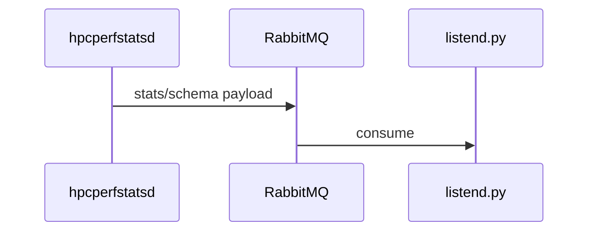

# Plan title (short)

One-line overview of the outcome.

**Governed by:** `agent-discipline-core.mdc` (always-on), `plan-completion-gate.mdc`, `plan-creation-contract.mdc` (plan authoring), `implementation-review-workflow.mdc`.

**Applies to:** pre-code chat plans, committed design docs in `HPCPerfStats/monitor/docs/plans/`, monitor **Consumer follow-up plan** sections, and Cursor Plan mode output.

**Artifact placement:** this file is a **committed design baseline** (`test-runs-output-directory.mdc`). Ephemeral run logs and verify captures go under **`<workspace_root>/test_runs/`**, not `docs/`.

---

## How to request a plan (user phrasing)

Use any of these when you want the agent to follow this template and the close gate:

- **“Create a plan per PLAN_TEMPLATE.md”**
- **“Include final code review per plan-creation-contract”**
- **“Implement this plan”** (with attached plan or Cursor Plan todos)

The agent must read this file, include **Final code review** and **Post-implementation review** sections, and add the **`post-implementation-review`** todo last. See **`plan-template-enforcement.mdc`** and **`plan-completion-gate.mdc`**.

**Do not mark implementation done** until the **close sequence** is complete (see **`plan-completion-gate.mdc`** → *Blocking close gate*): (1) **Agent rule dispatch** — list triggered **`*.mdc`** rules Read or N/A, (2) senior final code review on the diff and affected workflows finds no unfixed gaps, and (3) structured chat self-review is delivered (**Why it works**, **Edge cases**, **Convention check**). This applies to **all non-trivial code changes**, not only plan-driven work. **When implementing a plan:** also sync plan YAML todos (`status: completed` for every finished step—status-only plan edits are allowed even when plan prose must not change) and complete **`post-implementation-review`**.

---

## Cursor Plan frontmatter (optional)

Use when authoring in Cursor Plan mode. Do **not** edit committed plan files the user marked read-only (except **status-only** todo updates on the active implementation checklist per **`plan-completion-gate.mdc`**).

```yaml
---
name: short-kebab-name
overview: "One sentence outcome"
todos:
  - id: step-one
    content: "First implementation step"
    status: pending
  # … one todo per major step …
  - id: post-implementation-review
    content: "Final senior code review (diff + workflow) clean; structured self-review in chat (why it works, edge cases, convention check)"
    status: pending
isProject: false
---
```

---

## 1. Problem and facts

**Grounding (no guessing)** — per `plan-creation-contract.mdc`:

- Verified current behavior (cite modules, tests, logs, or committed docs read — not assumptions).
- Constraints and **user-confirmed** decisions.
- Affected layers (monitor C, emit/schema, RabbitMQ, consumer `listend.py` contract, packaging/spec).
- Open questions: list any unclear requirement and **ask the user** before implementing.

## 2. Approach

Ordered steps with trade-offs.

**Industry best practices** — name what informs the plan (e.g. test pyramid — unit `make check` before full static bundle; bounded hot-path work for HPC daemons). Prefer project rules (`monitor-c-testing-standards.mdc`, `monitor-jitter-and-fidelity-priority.mdc`) where they already encode local practice.

Optional architecture diagram:



## 3. Testing

Every behavior change needs at least one **regression and/or unit test** at the narrowest layer (`test-first-discipline.mdc`, `every-error-regression-test.mdc` for fixes).

| Test | Module | Contract |
|------|--------|----------|
| `test_…` | `HPCPerfStats/monitor/tests/test_*.c` | What it proves |

**Pre-merge verification matrix** (`global-testing-discipline.mdc`, `monitor-dual-verify-cross-and-static.mdc`, `monitor-valgrind-cpp-linter-gate.mdc`) — pick the minimum tier:

| Change touches | Minimum run |
|----------------|-------------|
| Pure helper / parser in `src/` | Targeted `tests/test_*.c` via `make check` |
| Substantive monitor C / Autotools | `scripts/build_static_bundle.sh` + `make check` in `.build-static` on **arches that compile the change** (`monitor-dual-verify-cross-and-static.mdc` §3) |
| Portable / multi-arch slice (shared daemon, Autotools-all-targets, **DCGM GPU**) | Also `scripts/cross_compile_test.sh --force-foreign --fail-fast` on a foreign family that **uses** the change |
| x86-only LIKWID / uncore / RAPL-via-LIKWID | x86_64 static + check; **skip aarch64** (ARM never uses LIKWID) |
| DCGM **CPU** only (Grace backend; not GPU) | aarch64 static or `TARGETS=aarch64-linux-gnu`; **skip x86_64** |
| Plan implementation closing (monitor C/tests/scripts) | Also `scripts/run_valgrind_check.sh` + `scripts/run_cpp_linter.sh` (logs under `test_runs/`) |
| `hpcperfstats.spec` / version fields | `rpmspec -P hpcperfstats.spec` |
| After successful verify | `make distclean` in build dir per `monitor-post-verify-distclean.mdc` |

Do **not** put unconditional ARM-on-x86 (or x86-on-ARM) foreign smoke in plan verify todos. Cite skipped families in the plan Testing section.

Runner (from monitor package dir; drop the cross line when §3 skips foreign):

```bash
cd HPCPerfStats/monitor && ./scripts/build_static_bundle.sh
make -C .build-static check
./scripts/cross_compile_test.sh --force-foreign --fail-fast   # portable / DCGM GPU only
make -C .build-static distclean
./scripts/run_valgrind_check.sh
./scripts/run_cpp_linter.sh
```

**Validation runbook** (`logic-change-checklist.mdc`):

1. Run smallest targeted test modules first.
2. Escalate to static bundle on **required CPU families**; add foreign cross only for portable / multi-arch diffs.
3. Append results to **`test_runs/test_run_log_YYYY-MM-DD.md`** (command, exit code, blockers) — not `docs/`.
4. Record residual risks if anything was skipped (name the arch family and the dual-verify table row).

## 4. Implementation

| Concern | Location |
|---------|----------|
| … | `HPCPerfStats/monitor/src/…` |

Omit this section for answer-only or doc-only work with no logic change.

## 5. Cursor rules / docs sync

Per `plan-creation-contract.mdc` step 5:

- **Add or update** a focused `HPCPerfStats/monitor/cursor-rules/*.mdc` when the plan introduces a **recurring** pattern.
- **Dual register** new domain rules in **`agent-discipline-core.mdc`** and **`cursor-hooks/hook_task_router.py`** (`MONITOR_ROUTER_ENTRIES`).
- **Prefer updating** an existing rule over duplicating; add an **Overlap** section when cross-linking.
- Or state **no rule change needed** + one-sentence rationale.

**Docs sync** (when triggered):

| Trigger | Update |
|---------|--------|
| Build / verify workflow | `HPCPerfStats/monitor/README.md`, `tests/README.md` (`monitor-readme-maintenance.mdc`) |
| Breaking emit/schema | `monitor/README.md` migration table, `docs/monitor_variable_rename_map.yaml` (`monitor-consumer-schema-migration.mdc`) |

## 6. Consumer follow-up plan (optional)

**Only when monitor output changes need consumer work** (`monitor-consumer-side-plan.mdc`). Do not implement consumer code unless the user authorizes it.

### Consumer follow-up plan

1. **Why** — monitor behavior changed; current consumer cannot handle it.
2. **What** — concrete consumer tasks (files/functions/tests).
3. **Rollout** — deploy order (consumer first vs together vs monitor escape hatch e.g. `enable_slow_tier 0`).
4. **Verification** — consumer tests or manual checks after both sides land.
5. **Rename/migration** — YAML map, dashboard/query updates if applicable.

State in the monitor summary: **consumer plan attached** or **no consumer changes required**.

## Invariants / edge cases

| Case | Expected |
|------|----------|
| … | … |

**Runtime logic** — also cover `logic-change-checklist.mdc` when behavior changes:

- Upstream contract (`listend.py` host token, `$` rotation vs append)
- Invariants before/after (tier gating, cumulative vs gauge)
- ≥1 transient failure mode + expected fallback
- Cross-layer name consistency (monitor emit → consumer archive path)

## Final code review (mandatory before implementation close)

Per `plan-creation-contract.mdc` step 6 and `plan-completion-gate.mdc` close-sequence **step 1** — act as a **Senior Software Engineer**. Review the **full diff** and every **workflow the change touches** (callers, tests, static bundle + **arch-scoped** cross-compile per `monitor-dual-verify-cross-and-static.mdc`, consumer contract, docs sync—not only files edited).

- [ ] Correctness and behavior regressions
- [ ] Performance regressions (jitter, hot-path work)
- [ ] Missing components (tests, docs, contract tests, spec/version sync)
- [ ] Edge cases not covered by tests
- [ ] New or re-triggered `cursor-rules/*.mdc` files dual-registered in **both** `agent-discipline-core.mdc` and `cursor-hooks/hook_task_router.py` (`MONITOR_ROUTER_ENTRIES`)
- [ ] Anything else a senior reviewer would block on merge

**Fix anything found** and re-run relevant tests. Do not proceed to post-implementation chat self-review or mark todos complete while open review items remain.

## Post-implementation review (required before close)

Per `plan-completion-gate.mdc` close-sequence **step 2** and `implementation-review-workflow.mdc` — **after** final code review is clean.

The implementing agent writes these **in chat** when closing the task (not only checkboxes here):

- [ ] **Why it works** — one paragraph, contracts cited
- [ ] **Edge cases** — ≥3 realistic failure modes named
- [ ] **Convention check** — tests, triggered rules, layer wiring, `test_runs/` logging; senior review pass had no unfixed gaps

Additional gates:

- [ ] Regression tests for any fixed/discovered errors (`every-error-regression-test.mdc`)
- [ ] Test run logged under `test_runs/` when tests executed (`test-runs-output-directory.mdc`)
- [ ] Runtime logic: `logic-change-checklist.mdc` satisfied (if applicable)
- [ ] `post-implementation-review` todo completed **last** (both close-sequence steps done)

If chat self-review surfaces a new gap, return to final code review, fix, re-test, then update the chat sections.

## Completion bar

Work described by this plan is **not complete** until:

- Tests added or extended and **executed** (or blockers documented per `test-first-discipline.mdc`)
- Cursor rules step done (rule added/updated, or explicit no-rule rationale)
- Plan YAML todos synced (`status: completed` for every finished step, or explicit deferral documented)
- **Final code review** (senior-engineer pass on diff and affected workflows) done with no unfixed findings
- Structured chat self-review delivered (`plan-completion-gate.mdc` step 2)
- Conclusions trace to **verified facts**

## Narrow exceptions

Skip full plan structure only for:

- Answer-only questions with no implementation
- Trivial typo or comment-only edits with no behavioral contract change
